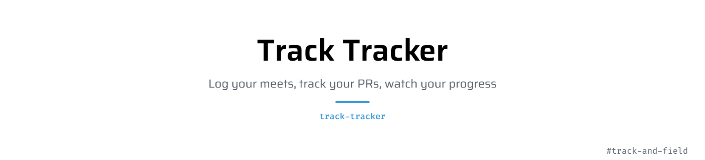
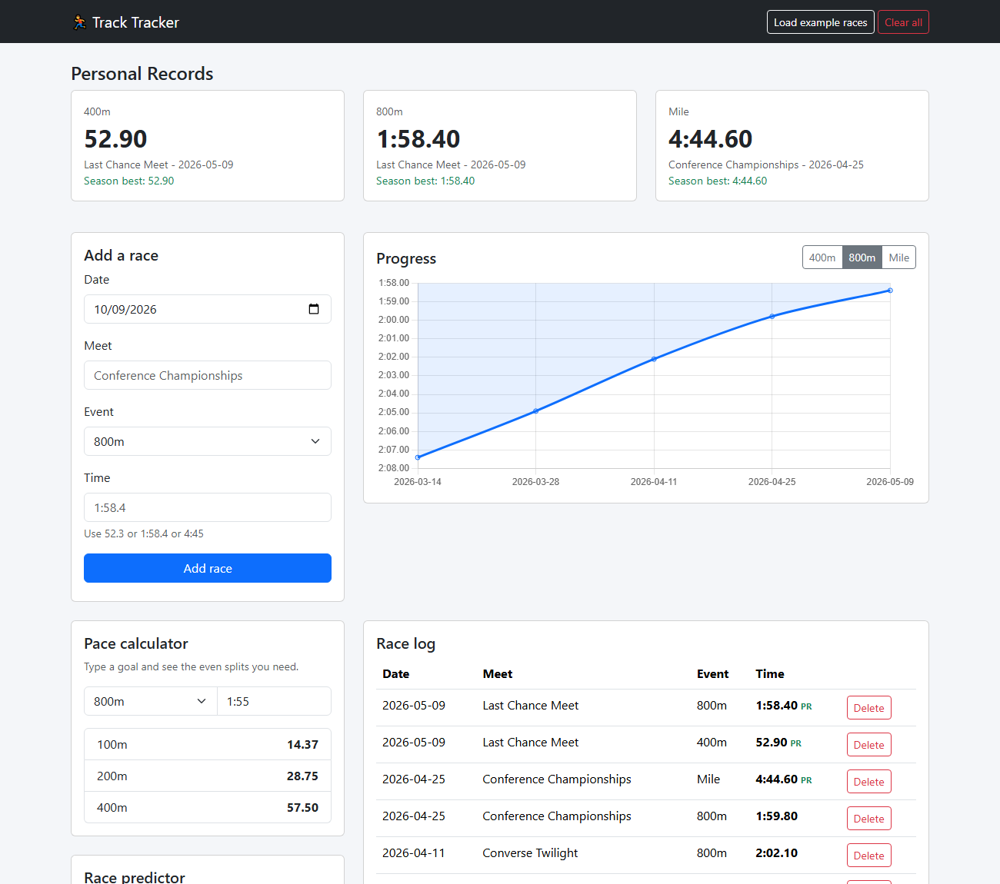

<picture>
   <source media="(prefers-color-scheme: dark)" srcset="art/header-dark.png">
   
</picture>

[](https://sheronsmith.github.io/track-tracker/?demo)
[](https://github.com/sheronsmith/track-tracker/actions)


A race log for runners. I run the 400, 800, and mile, so I made something to keep track of my times, see my PRs, and do the pace math for me.

There are two parts:

1. **Web app** - add races in your browser, see your PRs and a progress chart.
2. **SQLite version** - a Python script that loads a CSV of races into a database and runs queries on it.

**[Try the web app](https://sheronsmith.github.io/track-tracker/?demo)**



## Web app

### What it does

- Shows your PR in each event and your season best
- Chart of your times over the season (faster is higher)
- Pace calculator: type a goal like `1:55` and get your 100 / 200 / 400 splits
- Race predictor: uses your PR in one event to guess the others (Riegel formula)
- Race log with PRs marked
- Saves in your browser with localStorage, no login

### Run it

You need [Node.js](https://nodejs.org).

```bash
git clone https://github.com/sheronsmith/track-tracker.git
cd track-tracker
npm start
```

Open the link it prints. Put `?demo` on the end of the URL to see it with example races.

### Tests

```bash
npm test
```

### Built with

- HTML, CSS, JavaScript
- [Bootstrap 5](https://getbootstrap.com/) for the layout
- [Chart.js](https://www.chartjs.org/) for the chart

## SQLite version

The `python` folder has a script that does the same kind of thing with a real database.

```bash
cd python

python track_db.py load            # loads ../data/races.csv into track.db
python track_db.py prs             # fastest time in each event
python track_db.py season 2026     # season bests for a year
python track_db.py pace 800m       # average 400m split for each race
python track_db.py progress 800m   # every race in an event and how much it changed
```

Example output:

```
event  time     meet                      date
----------------------------------------------------
400m   52.90    Last Chance Meet          2026-05-09
800m   1:58.40  Last Chance Meet          2026-05-09
Mile   4:44.60  Conference Championships  2026-04-25
```

To track your own races, edit `data/races.csv` and run `load` again.

### Tests

```bash
cd python
python -m unittest -v
```

Only uses the Python standard library (`sqlite3`, `csv`, `unittest`). Nothing to install.

## Files

```
index.html              the page
style.css               a few tweaks on top of Bootstrap
script.js               page logic and the chart
track.js                time parsing, PRs, predictions (no browser code so it's testable)
test/track.test.js      JavaScript tests
data/races.csv          example race data
python/track_db.py      SQLite loader and queries
python/test_track_db.py Python tests
```

## Ideas for later

- Pull results from Athletic.net or MileSplit
- Export the race log to CSV
- More events

## License

MIT
